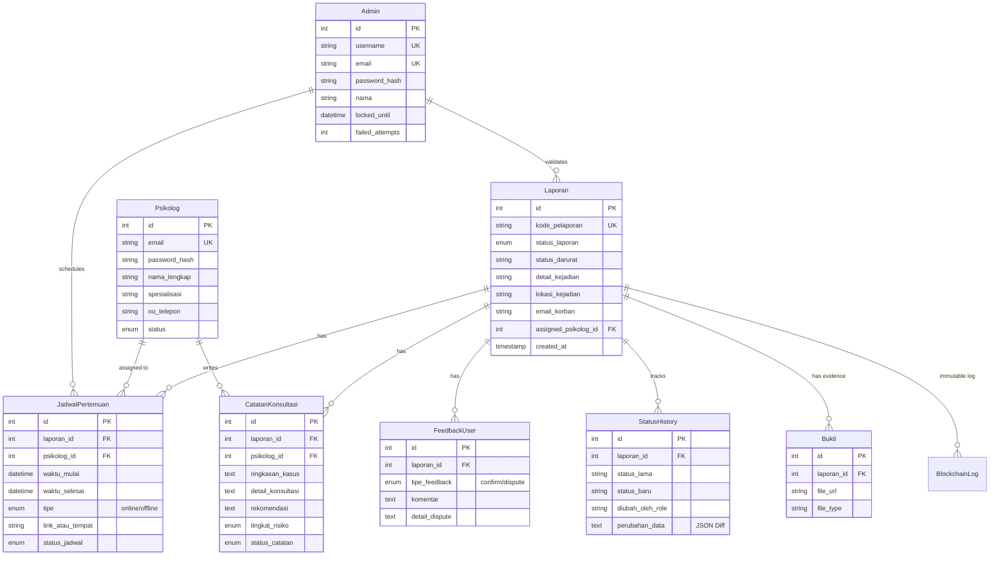
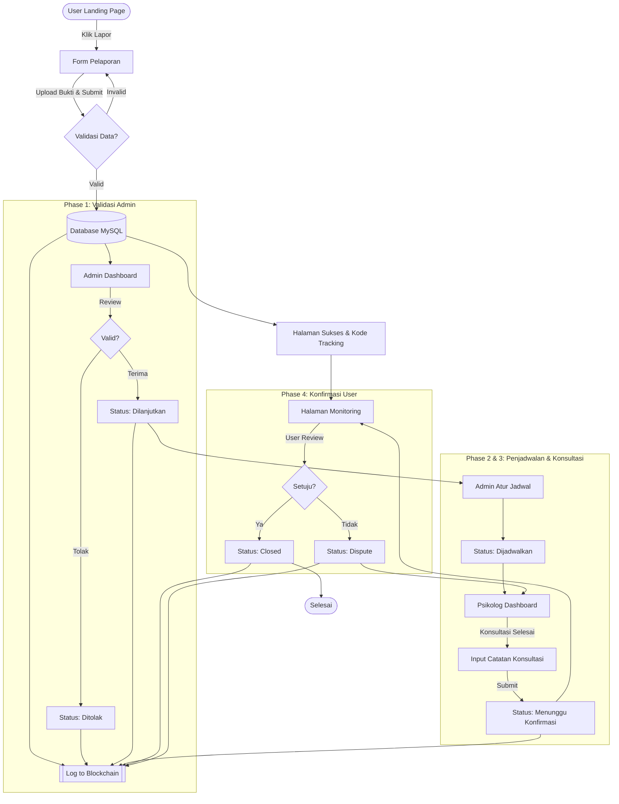

# Dokumentasi Sistem SIGAP PPKPT

## 1. Entity Relationship Diagram (ERD)

Diagram ini menggambarkan struktur database dan relasi antar tabel dalam sistem.



---

## 2. Use Case Diagram

Diagram ini menggambarkan interaksi aktor dengan fitur-fitur sistem.

```mermaid
usecaseDiagram
    actor "Masyarakat (User)" as User
    actor "Administrator" as Admin
    actor "Psikolog" as Psikolog
    actor "Blockchain System" as Chain

    package "SIGAP PPKPT System" {
        usecase "Melapor Kekerasan" as UC1
        usecase "Monitoring Status (Tracking)" as UC2
        usecase "Upload Bukti" as UC3
        usecase "Konfirmasi/Dispute Hasil" as UC4
        
        usecase "Validasi Laporan" as UC5
        usecase "Penjadwalan Konsultasi" as UC6
        usecase "Manajemen User" as UC7
        
        usecase "Input Catatan Konsultasi" as UC8
        usecase "Lihat Jadwal & Penugasan" as UC9
        
        usecase "Log Audit Trail" as UC10
    }

    User --> UC1
    User --> UC2
    User --> UC3
    User --> UC4

    Admin --> UC5
    Admin --> UC6
    Admin --> UC7
    Admin --> UC2 : "View All"

    Psikolog --> UC8
    Psikolog --> UC9
    Psikolog --> UC2 : "View Assigned"

    UC1 ..> UC10 : <<include>>
    UC5 ..> UC10 : <<include>>
    UC8 ..> UC10 : <<include>>
    UC4 ..> UC10 : <<include>>

    UC10 --> Chain : "Record Hash"
```

---

## 3. Website Flow Diagram (Process Flow)

Alur proses dari pelaporan hingga penyelesaian kasus.


